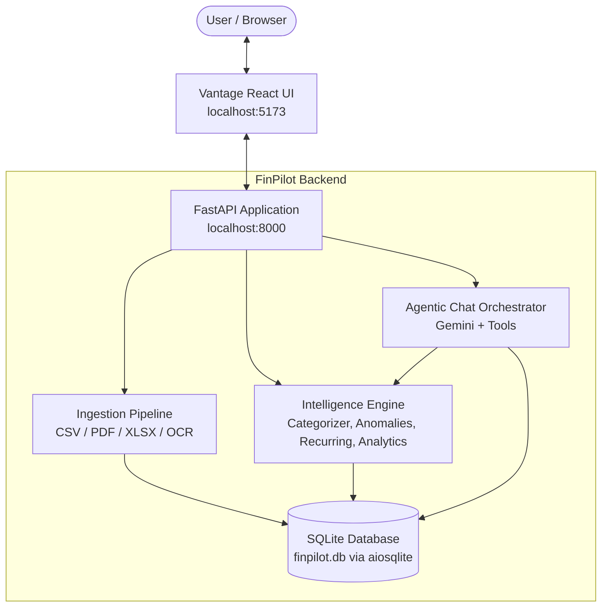

# FinPilot — Personal Finance Intelligence & Agentic AI

FinPilot (Vantage Finance) is an end-to-end, agentic personal finance intelligence platform. It ingests bank statements and receipt images across multiple formats, normalizes and categorizes transactions, runs explainable analytics (anomalies, recurring subscriptions, budgets, and savings goals), and provides a conversational AI assistant with tool calling and strict guardrails.

---

## 🌟 Key Features

- **Multi-Format Ingestion**:
  - Ingests **CSV**, **Excel (.xlsx)**, **PDF** statements, and **Receipt Images (JPG, PNG)** with OCR via Tesseract and OpenCV.
  - Automatic column mapping, date parsing, currency normalization, and deduplication against existing database records.
- **Explainable Financial Intelligence**:
  - **Categorization Engine**: User overrides & rules first, deterministic merchant keywords second, Gemini LLM fallback third.
  - **Subscription & Recurring Detection**: Unsupervised detection of regular intervals and amounts without requiring external labels.
  - **Anomaly Detection**: Robust statistical anomaly detection using Median Absolute Deviation (MAD) for unusual transaction spikes and monthly category deviations.
  - **Budgets & Goals**: Real-time spending progress, month-end projections, and goal savings timeline tracking.
- **Agentic AI Chat Assistant**:
  - Powered by **Google Gemini** (`gemini-3-flash-preview`).
  - Dynamic tool calling against local financial data (spending, budgets, subscriptions, upload summaries).
  - Safety guardrails preventing speculative investment advice and disclaiming non-advisory boundaries.
- **Modern Responsive Web UI ("Vantage")**:
  - Built with **React 18** and **Vite**.
  - Interactive dashboard, category donut charts, area trends, transaction table with live category correction, upload dropzone with status polling, and chat assistant.

---

## 🏗️ Architecture Overview



---

## 📁 Project Structure

```
├── app/
│   ├── main.py                  # FastAPI app, CORS, lifespan database auto-init, health routes
│   ├── agent/                   # Conversational AI assistant
│   │   ├── orchestrator.py      # LLM turn loop, prompt engineering, retry logic
│   │   ├── tools.py             # Tools invoked by agent (budgets, summaries, transactions)
│   │   └── context_store.py     # Session state & chat history persistence
│   ├── api/                     # REST API endpoints
│   │   ├── chat.py              # POST /chat
│   │   ├── uploads.py           # POST /uploads, GET /uploads/{id}
│   │   └── intelligence.py      # Monthly summaries, transactions, category overrides
│   ├── db/                      # Database & data access layer
│   │   ├── models.py            # SQLAlchemy models (Upload, Transaction, Budget, Goal, etc.)
│   │   ├── repository.py        # Async queries and mutations
│   │   └── database.py          # Table initialization (init_db)
│   ├── ingestion/               # Multi-format ingestion pipeline
│   │   ├── dispatcher.py        # Sniffs content type and dispatches to appropriate parser
│   │   ├── parsers/             # Specialized parsers (CSV, Excel, PDF, OCR)
│   │   ├── normalize.py         # Schema mapping and field cleansing
│   │   ├── validate.py          # Deduplication & validation rules
│   │   └── pipeline.py          # Background worker coordinating ingestion & intelligence
│   └── intelligence/            # Analytics & ML engine
│       ├── engine.py            # Facade for intelligence modules
│       ├── categorization/      # Rules, user overrides, and LLM fallback
│       ├── anomalies/           # MAD-based transaction & category anomaly detection
│       ├── recurring/           # Interval regularity subscription detector
│       ├── analytics/           # Monthly summaries and period comparisons
│       ├── budgets/             # Budget utilization & projections
│       └── goals/               # Savings goal progress and timelines
│
├── frontend/
│   └── finpilot-ui/             # React 18 + Vite frontend
│       ├── src/
│       │   ├── screens/         # Landing, Dashboard, Transactions, Summary, Upload, Chat
│       │   ├── components/      # Shell, UI widgets, Charts (Donut, Area, Gauge)
│       │   ├── context/         # SessionContext (per-tab user session isolation)
│       │   └── api.js           # Centralized API service client
│       └── package.json
│
├── tests/                       # Pytest test suite for intelligence & ingestion
├── pytest.ini                   # Pytest configuration with pythonpath set
├── requirements.txt             # Python backend dependencies
└── README.md                    # Project documentation
```

---

## 🚀 Quick Start

### 1. Prerequisites

- **Python**: 3.11 or 3.12 (Recommended: Python 3.12)
- **Node.js**: v18 or later (with `npm`)
- **Tesseract OCR** *(Optional, required only for receipt image OCR)*:
  - Windows: [UB-Mannheim Tesseract Installer](https://github.com/UB-Mannheim/tesseract/wiki)

---

### 2. Backend Setup

1. **Create and activate a virtual environment**:
   ```powershell
   # Windows PowerShell
   py -3.12 -m venv .venv
   .\.venv\Scripts\Activate.ps1
   ```
   ```bash
   # Linux / macOS
   python3 -m venv .venv
   source .venv/bin/activate
   ```

2. **Install dependencies**:
   ```bash
   pip install -r requirements.txt
   ```

3. **Configure Environment Variables**:
   Create or edit `.env` in the root directory:
   ```ini
   GEMINI_API_KEY=your_gemini_api_key_here
   GEMINI_MODEL=gemini-3-flash-preview
   DATABASE_URL=sqlite+aiosqlite:///./finpilot.db
   ```

4. **Start the FastAPI server**:
   ```bash
   python -m uvicorn app.main:app --host 127.0.0.1 --port 8000 --reload
   ```
   - API Root: [http://localhost:8000](http://localhost:8000)
   - Health Check: [http://localhost:8000/health](http://localhost:8000/health)
   - Interactive Swagger Docs: [http://localhost:8000/docs](http://localhost:8000/docs)

---

### 3. Frontend Setup

1. **Navigate to the frontend directory**:
   ```bash
   cd frontend/finpilot-ui
   ```

2. **Install dependencies**:
   ```bash
   npm install
   ```

3. **Configure Frontend Environment** (optional, defaults to `http://localhost:8000`):
   Ensure `frontend/finpilot-ui/.env` contains:
   ```ini
   VITE_API_BASE=http://localhost:8000
   ```

4. **Start the Vite development server**:
   ```bash
   npm run dev
   ```
   - Open your browser at **[http://localhost:5173](http://localhost:5173)**.

---

## 🧪 Testing

Run the automated test suite with `pytest`:

```bash
# Run all tests
pytest

# Run tests with verbose output
pytest -v

# Run intelligence module tests only
pytest tests/intelligence
```

---

## 📡 Key API Endpoints

| Method | Endpoint | Description |
| :--- | :--- | :--- |
| `GET` | `/health` | Service health status check |
| `GET` | `/` | API status and links to documentation |
| `POST` | `/uploads?user_id={id}` | Upload bank statement (CSV, XLSX, PDF, Image) |
| `GET` | `/uploads/{upload_id}` | Check async ingestion status and flagged rows |
| `GET` | `/intelligence/monthly-summary?month=YYYY-MM` | Aggregate monthly income, expense, savings, and anomalies |
| `GET` | `/intelligence/transactions?user_id={id}` | Query normalized transactions with optional month/category filters |
| `POST` | `/intelligence/category-correction` | Persist user merchant-to-category rule overrides |
| `POST` | `/intelligence/categorize` | Trigger batch categorization on stored records |
| `POST` | `/chat` | Agentic AI chat turn with tool calling & guardrails |

---

## 🛡️ Guardrails & Safety

FinPilot includes safety mechanisms in `app/agent/orchestrator.py`:
- **Financial Boundary**: Does not recommend individual stocks, crypto purchases, or specific speculative investments.
- **Advisory Disclaimers**: Clarifies that AI responses are for informational and budgeting decision support only.
- **Deterministic Precedence**: User manual category overrides always supersede AI and heuristic classifiers.

---

## 📄 License

This project is licensed under the MIT License.
